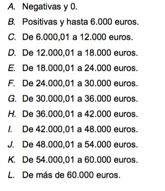

# TRABAJO FIN DE GRADO

## Análisis Regional Del IPRF : Desigualdad Y Progresividad Regional Para España

### Autor

Maximiliano Greco

### Director

Fernando Rodrigo Sauco

--- 

Facultad de Ciencias Económicas y Empresariales
Año 2015

## NOTEBOOK CÁLCULOS

[Enlace Externo](http://nbviewer.ipython.org/github/mmngreco/Fiscal/blob/master/Muestra2011.ipynb)

---

# MOTIVACIÓN

La economía pública como disiplina tiene especial interés cuando se trata de corregir los fallos de mercado y promover el correcto funcionamiento de un país. Hoy en día el estado tiene la mayor parte de responsabilidad a la hora de fomentar el crecimietno de un país, gracias a la tendencia creciente en nuestro país en lo relativo a la difusión datos, parece el mejor final de una etapa, la correcta aplicación de los conocimientos adquiridos durante los años de formación en economía a fin de tocar la mayoría de áreas estudiadas.

# METODOLOGÍA DE LA MUESTRA

Para este trabajo se ha utilizado la "Muestra IEF-AEAT 2011", que consta de 2 036 186 observaciones (declaraciones) y 447 variables que para este trabajo ha sido reducido a 27 variables (#DESCRIPCIÓN) en función de  su interés para este trabajo.

## TRAMOS

Los tramos de renta elegidos para definir los niveles de renta en este trabajo son los 12 tramos propuestos por _López, C. P. et al_ en _'La muestra de IRPF de 2011: Descripción general y principales magnitudes'_[^1]

[^1]: López, C. P., García, J. V., Prieto, M. J. B., Huete, E. P., & Pastor, A. M. (2014). La muestra de IRPF de 2011: Descripción general y principales magnitudes [1](http://www.ief.es/documentos/recursos/publicaciones/documentos_trabajo/2014_17.pdf). Documentos-Instituto de Estudios Fiscales, (17), 1-186.

## REPRESENTATIVIDAD

En el documento de _López, C. P. et al_[^1], hacen una comparación entre los agregados monetarios proporcionados por la Base De Datos Económicos Del Sector Público Español y la muestra IRPF IEF-AEAT 2011, y obtienen como conclusión que agregadamente la muestra se ajusta muy bien a la realidad, con diferencias inferiores al 2%, para las variables que usadas en este trabajo.

Como enumeran _López, C. P. et al_ la principales ventajas e inconvenientes de la muestra son:

### Ventajas

- Gran representatividad debida al muestreo estratificado.
- Ausencia de problemas de infrarre presentación y falta de respuesta.
- Alta precisión debida al origen fiscal de los datos.
- Elevada representatividad poblacional debido a la inclusión de no declarantes.

### Inconvenientes

- Imposibilidad de separar las rentas de las declaraciones conjuntas debido a la unidad de análisis (declaración).
- Imposibilidad de construir declaraciones conjuntas a partir de individuales ni unir a los declarantes en hogares, debido a la inexistencia de información que relacione las declaraciones.
- Falta de cualquier información extrafiscal no necesaria para la liquidación del impuesto correspondiente.
- No representatividad de no declarantes que no soportaron retención por rendimientos del trabajo.

# ANÁLISIS DESCRIPTIVO DE LA MUESTRA

Comenzamos comprobando las principales magnitudes monetarias de las variables de interés usadas en este trabajo y contrastando con los resultados de BADESPE y [foot1].

## TABLA 1

<table border="1" class="dataframe">  <thead>    <tr style="text-align: center;">      <th></th>      <th>TOTAL</th>    </tr>  </thead>  <tbody>    <tr>      <th>OBSERVACIONES MUESTRA</th>      <td>2 036 186.000</td>    </tr>    <tr>      <th>DECLARACIONES MUESTRA</th>      <td>19 467 623.101</td>    </tr>    <tr>      <th>DECLARACIONES AEAT</th>      <td>19 467 730.000</td>    </tr>    <tr>      <th>DIFERENCIA PORCENTAJE</th>      <td>-0.001%</td>    </tr>  </tbody></table>

## TABLA 2

<table border="1" class="dataframe">  <thead>    <tr style="text-align: center;">      <th></th>      <th>DESCRIPCIÓN</th>      <th>IMPORTE (MILLONES DE EUROS)</th>      <th>MEDIA</th>      <th>MÍNIMO</th>      <th>MÁXIMO</th>    </tr>  </thead>  <tbody>    <tr>      <th>PAR1</th>      <td>RENDIMIENTOS DEL TRABAJO: DINERARIAS</td>      <td>393 844.000</td>      <td>20 230.718</td>      <td>0.000</td>      <td>27 676 513.630</td>    </tr>    <tr>      <th>PAR9</th>      <td>RENDIMIENTOS DEL TRABAJO. TOTAL INGRESOS INTEGROS COMPUTABLES</td>      <td>395 653.901</td>      <td>20 323.688</td>      <td>-49 100.000</td>      <td>27 709 267.780</td>    </tr>    <tr>      <th>PAR17</th>      <td>REDUCCIÓN POR OBTENCIÓN RDTO. TRABAJO.CUANTÍA APLICABLE CON CARÁCTER GENERAL.</td>      <td>51 518.789</td>      <td>2 646.383</td>      <td>0.000</td>      <td>4 080.000</td>    </tr>    <tr>      <th>PAR18</th>      <td>REDUCCIÓN POR OBTENCIÓN RDTO. TRABAJO.INCREMENTO PARA TRABAJADORES ACTIVOS MAYORES DE 65 AÑOS QUE CONTINUEN O PROLONGUEN LA ACTIVIDAD LABORAL.</td>      <td>133.876</td>      <td>6.877</td>      <td>0.000</td>      <td>5 966.250</td>    </tr>    <tr>      <th>PAR19</th>      <td>REDUCCIÓN POR OBTENCIÓN RDTO. TRABAJO.INCREMENTO PARA CONTRIB. DESEMPLEADOS QUE ACEPTEN UN PUESTO QUE EXIJA TRASLADO DE MUNICIPIO.</td>      <td>110.850</td>      <td>5.694</td>      <td>0.000</td>      <td>4 080.000</td>    </tr>    <tr>      <th>PAR20</th>      <td>REDUCCIÓN POR OBTENCIÓN RDTO. TRABAJO.REDUCCIÓN ADICIONAL PARA TRABAJADORES ACTIVOS QUE SEAN PRESONAS CON DISCAPACIDAD.</td>      <td>1 128.314</td>      <td>57.958</td>      <td>0.000</td>      <td>7 242.000</td>    </tr>    <tr>      <th>PAR452</th>      <td>SALDO NETO DE RENDIMIENTOS E IMPUTACIONES DE RENTA.</td>      <td>361 464.579</td>      <td>18 567.474</td>      <td>-10 964 259.270</td>      <td>27 708 778.330</td>    </tr>    <tr>      <th>PAR455</th>      <td>BASE IMPONIBLE GENERAL</td>      <td>362 315.831</td>      <td>18 611.200</td>      <td>-10 964 259.270</td>      <td>27 708 778.330</td>    </tr>    <tr>      <th>PAR465</th>      <td>BASE IMPONIBLE DEL AHORRO</td>      <td>29 964.184</td>      <td>1 539.180</td>      <td>0.000</td>      <td>90 172 902.510</td>    </tr>    <tr>      <th>PAR620</th>      <td>BASE LIQUIDABLE GENERAL SOMETIDA A GRAVAMEN.</td>      <td>343 375.342</td>      <td>17 638.278</td>      <td>-10 964 259.270</td>      <td>27 692 878.330</td>    </tr>    <tr>      <th>PAR630</th>      <td>BASE LIQUIDABLE DEL AHORRO.</td>      <td>29 781.110</td>      <td>1 529.776</td>      <td>0.000</td>      <td>90 172 902.510</td>    </tr>    <tr>      <th>PAR698</th>      <td>CUOTA ÍNTEGRA ESTATAL</td>      <td>36 332.411</td>      <td>1 866.299</td>      <td>0.000</td>      <td>9 496 814.740</td>    </tr>    <tr>      <th>PAR699</th>      <td>CUOTA ÍNTEGRA AUTONÓMICA</td>      <td>36 096.888</td>      <td>1 854.201</td>      <td>0.000</td>      <td>9 497 124.950</td>    </tr>    <tr>      <th>PAR720</th>      <td>CUOTA LÍQUIDA ESTATAL</td>      <td>33 906.315</td>      <td>1 741.677</td>      <td>0.000</td>      <td>9 496 671.210</td>    </tr>    <tr>      <th>PAR721</th>      <td>CUOTA LÍQUIDA AUTONÓMICA</td>      <td>33 342.451</td>      <td>1 712.713</td>      <td>0.000</td>      <td>9 496 981.430</td>    </tr>    <tr>      <th>PAR741</th>      <td>CUOTA RESULTANTE DE LA AUTOLIQUIDACIÓN</td>      <td>66 265.874</td>      <td>3 403.902</td>      <td>0.000</td>      <td>18 993 652.640</td>    </tr>    <tr>      <th>PAR756</th>      <td>DEDUCCION POR MATERNIDAD: IMPORTE DE LA DEDUCCION</td>      <td>780.045</td>      <td>40.069</td>      <td>0.000</td>      <td>12 000.000</td>    </tr>    <tr>      <th>PAR760</th>      <td>RESULTADO</td>      <td>-4 755.387</td>      <td>-244.272</td>      <td>-7 449 387.640</td>      <td>18 747 696.050</td>    </tr>    <tr>      <th>PAR716</th>      <td>DEDUCCIÓN POR ALQUILER DE VIVIENDA HABITUAL, PARTE AUTONÓMICA</td>      <td>173.100</td>      <td>8.892</td>      <td>0.000</td>      <td>454.260</td>    </tr>  </tbody></table>

## TABLA 3

<table border="1" class="dataframe">  <thead>    <tr style="text-align: center;">      <th>CÓDIGO PROVINCIA</th>      <th>PROVINCIA</th>      <th>Nº OBSERVACIONES</th>      <th>Nº DECLARACIONES MUESTRA</th>    </tr>  </thead>  <tbody>    <tr>      <td>2</td>      <td>ALBACETE</td>      <td>28 396.000</td>      <td>174 144.515</td>    </tr>    <tr>      <td>3</td>      <td>ALICANTE</td>      <td>66 221.000</td>      <td>715 160.654</td>    </tr>    <tr>      <td>4</td>      <td>ALMERIA</td>      <td>34 520.000</td>      <td>256 571.027</td>    </tr>    <tr>      <td>5</td>      <td>ÁVILA</td>      <td>18 185.000</td>      <td>76 925.266</td>    </tr>    <tr>      <td>6</td>      <td>BADAJOZ</td>      <td>35 798.000</td>      <td>285 492.998</td>    </tr>    <tr>      <td>7</td>      <td>BALEARES</td>      <td>50 379.000</td>      <td>470 830.881</td>    </tr>    <tr>      <td>8</td>      <td>BARCELONA</td>      <td>189 526.000</td>      <td>2 624 269.644</td>    </tr>    <tr>      <td>9</td>      <td>BURGOS</td>      <td>26 114.000</td>      <td>197 583.513</td>    </tr>    <tr>      <td>10</td>      <td>CACERES</td>      <td>29 818.000</td>      <td>189 340.467</td>    </tr>    <tr>      <td>11</td>      <td>CÁDIZ</td>      <td>50 467.000</td>      <td>449 835.271</td>    </tr>    <tr>      <td>12</td>      <td>CASTELLÓN</td>      <td>37 403.000</td>      <td>280 628.762</td>    </tr>    <tr>      <td>13</td>      <td>CIUDAD REAL</td>      <td>30 922.000</td>      <td>215 112.410</td>    </tr>    <tr>      <td>14</td>      <td>CÓRDOBA</td>      <td>35 885.000</td>      <td>336 641.815</td>    </tr>    <tr>      <td>15</td>      <td>A CORUÑA</td>      <td>54 281.000</td>      <td>542 895.751</td>    </tr>    <tr>      <td>16</td>      <td>CUENCA</td>      <td>19 267.000</td>      <td>92 223.192</td>    </tr>    <tr>      <td>17</td>      <td>GIRONA</td>      <td>37 879.000</td>      <td>329 200.412</td>    </tr>    <tr>      <td>18</td>      <td>GRANADA</td>      <td>41 667.000</td>      <td>367 160.685</td>    </tr>    <tr>      <td>19</td>      <td>GUADALAJARA</td>      <td>20 757.000</td>      <td>115 227.819</td>    </tr>    <tr>      <td>21</td>      <td>HUELVA</td>      <td>31 474.000</td>      <td>197 549.806</td>    </tr>    <tr>      <td>22</td>      <td>HUESCA</td>      <td>19 759.000</td>      <td>113 311.975</td>    </tr>    <tr>      <td>23</td>      <td>JAEN</td>      <td>32 770.000</td>      <td>290 045.128</td>    </tr>    <tr>      <td>24</td>      <td>LEÓN</td>      <td>28 821.000</td>      <td>237 917.555</td>    </tr>    <tr>      <td>25</td>      <td>LLEIDA</td>      <td>28 301.000</td>      <td>202 205.571</td>    </tr>    <tr>      <td>26</td>      <td>LA RIOJA</td>      <td>26 131.000</td>      <td>165 077.680</td>    </tr>    <tr>      <td>27</td>      <td>LUGO</td>      <td>24 898.000</td>      <td>164 071.872</td>    </tr>    <tr>      <td>28</td>      <td>MADRID</td>      <td>224 512.000</td>      <td>3 098 223.245</td>    </tr>    <tr>      <td>29</td>      <td>MÁLAGA</td>      <td>60 295.000</td>      <td>577 554.153</td>    </tr>    <tr>      <td>30</td>      <td>MURCIA</td>      <td>56 369.000</td>      <td>575 949.708</td>    </tr>    <tr>      <td>32</td>      <td>OURENSE</td>      <td>24 779.000</td>      <td>141 668.559</td>    </tr>    <tr>      <td>33</td>      <td>OVIEDO</td>      <td>53 134.000</td>      <td>532 038.254</td>    </tr>    <tr>      <td>34</td>      <td>PALENCIA</td>      <td>16 689.000</td>      <td>85 264.342</td>    </tr>    <tr>      <td>35</td>      <td>LAS PALMAS</td>      <td>42 493.000</td>      <td>407 924.364</td>    </tr>    <tr>      <td>36</td>      <td>PONTEVEDRA</td>      <td>45 036.000</td>      <td>412 933.097</td>    </tr>    <tr>      <td>37</td>      <td>SALAMANCA</td>      <td>25 776.000</td>      <td>167 297.376</td>    </tr>    <tr>      <td>38</td>      <td>TENERIFE</td>      <td>41 568.000</td>      <td>367 091.901</td>    </tr>    <tr>      <td>39</td>      <td>CANTABRIA</td>      <td>35 893.000</td>      <td>278 668.555</td>    </tr>    <tr>      <td>40</td>      <td>SEGOVIA</td>      <td>16 207.000</td>      <td>75 858.329</td>    </tr>    <tr>      <td>41</td>      <td>SEVILLA</td>      <td>66 862.000</td>      <td>745 209.510</td>    </tr>    <tr>      <td>42</td>      <td>SORIA</td>      <td>12 234.000</td>      <td>50 466.388</td>    </tr>    <tr>      <td>43</td>      <td>TARRAGONA</td>      <td>38 824.000</td>      <td>352 932.332</td>    </tr>    <tr>      <td>44</td>      <td>TERUEL</td>      <td>15 885.000</td>      <td>72 372.312</td>    </tr>    <tr>      <td>45</td>      <td>TOLEDO</td>      <td>35 998.000</td>      <td>306 027.921</td>    </tr>    <tr>      <td>46</td>      <td>VALENCIA</td>      <td>98 774.000</td>      <td>1 194 860.822</td>    </tr>    <tr>      <td>47</td>      <td>VALLADOLID</td>      <td>37 132.000</td>      <td>278 213.674</td>    </tr>    <tr>      <td>49</td>      <td>ZAMORA</td>      <td>18 676.000</td>      <td>87 489.187</td>    </tr>    <tr>      <td>50</td>      <td>ZARAGOZA</td>      <td>50 627.000</td>      <td>513 687.450</td>    </tr>    <tr>      <td>51</td>      <td>CEUTA</td>      <td>8 112.000</td>      <td>27 444.512</td>    </tr>    <tr>      <td>52</td>      <td>MELILLA</td>      <td>8 371.000</td>      <td>26 125.541</td>    </tr>    <tr>      <td>99</td>      <td>NO RESIDENTES</td>      <td>2 301.000</td>      <td>2 896.902</td>    </tr>    <tr>      <td>-</td>      <th>TOTAL</th>      <th>2 036 186.000</th>      <th>19 467 623.101</th>    </tr>  </tbody></table>

--- 

# ANEXO

## HERRAMIENTAS TÉCNICAS:

### Software:

#### Python

- Librerías
    + SciPy
    + NumPy
    + seaborn
    + Pandas
    + Statsmodels

#### R

- reldist
- ineq

## VARIABLES

<table border="1" class="dataframe">  <thead>    <tr style="text-align: center;">      <th></th>      <th>DESCRIPCIÓN</th>    </tr>    <tr>      <th>VARIABLE</th>      <th></th>    </tr>  </thead>  <tbody>    <tr>      <th>prov</th>      <td>PROVINCIA</td>    </tr>    <tr>      <th>ca</th>      <td>COMUNIDAD AUTÓNOMA</td>    </tr>    <tr>      <th>dec</th>      <td>TIPO DE DECLARACIÓN</td>    </tr>    <tr>      <th>sexo</th>      <td>SEXO DEL DECLARANTE</td>    </tr>    <tr>      <th>EstCv</th>      <td>ESTADO CIVIL DEL DECLARANTE</td>    </tr>    <tr>      <th>NmDesc</th>      <td>NÚMERO DE DESCENDIENTES</td>    </tr>    <tr>      <th>factor</th>      <td>FACTOR DE ELEVACIÓN</td>    </tr>    <tr>      <th>PAR1</th>      <td>RENDIMIENTOS DEL TRABAJO: DINERARIAS</td>    </tr>    <tr>      <th>PAR9</th>      <td>RENDIMIENTOS DEL TRABAJO. TOTAL INGRESOS INTEGROS COMPUTABLES</td>    </tr>    <tr>      <th>PAR17</th>      <td>REDUCCIÓN POR OBTENCIÓN RDTO. TRABAJO.CUANTÍA APLICABLE CON CARÁCTER GENERAL.</td>    </tr>    <tr>      <th>PAR18</th>      <td>REDUCCIÓN POR OBTENCIÓN RDTO. TRABAJO.INCREMENTO PARA TRABAJADORES ACTIVOS MAYORES DE 65 AÑOS QUE CONTINUEN O PROLONGUEN LA ACTIVIDAD LABORAL.</td>    </tr>    <tr>      <th>PAR19</th>      <td>REDUCCIÓN POR OBTENCIÓN RDTO. TRABAJO.INCREMENTO PARA CONTRIB. DESEMPLEADOS QUE ACEPTEN UN PUESTO QUE EXIJA TRASLADO DE MUNICIPIO.</td>    </tr>    <tr>      <th>PAR20</th>      <td>REDUCCIÓN POR OBTENCIÓN RDTO. TRABAJO.REDUCCIÓN ADICIONAL PARA TRABAJADORES ACTIVOS QUE SEAN PRESONAS CON DISCAPACIDAD.</td>    </tr>    <tr>      <th>PAR452</th>      <td>SALDO NETO DE RENDIMIENTOS E IMPUTACIONES DE RENTA.</td>    </tr>    <tr>      <th>PAR455</th>      <td>BASE IMPONIBLE GENERAL</td>    </tr>    <tr>      <th>PAR465</th>      <td>BASE IMPONIBLE DEL AHORRO</td>    </tr>    <tr>      <th>PAR620</th>      <td>BASE LIQUIDABLE GENERAL SOMETIDA A GRAVAMEN.</td>    </tr>    <tr>      <th>PAR630</th>      <td>BASE LIQUIDABLE DEL AHORRO.</td>    </tr>    <tr>      <th>PAR698</th>      <td>CUOTA ÍNTEGRA ESTATAL</td>    </tr>    <tr>      <th>PAR699</th>      <td>CUOTA ÍNTEGRA AUTONÓMICA</td>    </tr>    <tr>      <th>PAR720</th>      <td>CUOTA LÍQUIDA ESTATAL</td>    </tr>    <tr>      <th>PAR721</th>      <td>CUOTA LÍQUIDA AUTONÓMICA</td>    </tr>    <tr>      <th>PAR741</th>      <td>CUOTA RESULTANTE DE LA AUTOLIQUIDACIÓN</td>    </tr>    <tr>      <th>PAR756</th>      <td>DEDUCCION POR MATERNIDAD: IMPORTE DE LA DEDUCCION</td>    </tr>    <tr>      <th>PAR760</th>      <td>RESULTADO</td>    </tr>    <tr>      <th>PAR716</th>      <td>DEDUCCIÓN POR ALQUILER DE VIVIENDA HABITUAL, PARTE AUTONÓMICA</td>    </tr>    <tr>      <th>PAR772</th>      <td>POR ALQUILER DE VIVIENDA HABITUAL PARTE AUTONÓMICA</td>    </tr>  </tbody></table>

---

# NOTAS

## PREGUNTAS

1. Contexto del IRPF 2011
1. El perfil del IRPF en España y CCAA
    + Distribucion de población, España y CCAA
    + Distribucion de los ingresos CCAA
    + Distribucion de declarantes por renta
    + Distribucion de declarantes por CCAA y tg
    + Diferencia entre Ingresos CCAA y Estatal
    + Disperción de Cuota Liquida autonómica y Rentas altas
1. ¿Es el IRPF un impuesto progresivo?
    + Progresividad Local
        * LP
        * ARP
    + Progresividad Global
        * Gini
        * RS
        * Atkinson
1. Caso de Aragón. (sería interesante agregar cataluña o madrid y comparar)
    + Perfil
    + Como se sitúa en presión fiscal
    + Indices
        * LP
        * Gini
        * RS
1. Simulación
    + Hipótesis de partida evolución hasta 2016
        * Evolución BI (PIB o Renta Disponible, media BI)

1. Conclusiones
1. Extensiones del Trabajo
    + Competencia Fiscal

# IDEAS:

1. ¿Es el gasto público progresivo?
1. Modelo de distribución de la renta, partiendo del ideal y ver su evolución.
1. ¿Son los individuos racionales?
    - Tributación conjunta vs tributación individual para mismas rentas
1. Contraste de Hipótesis:
     - PARA TODOS LOS SUPUESTOS
     - INTERVALO DE CONFIANZA

## POSIBLES EXTENSIONES DEL TRABAJO
1. ¿Es el gasto público progresivo?
1. Modelo de distribución de la renta, partiendo del ideal y ver su evolución.
1. ¿Son los individuos racionales?
    - Tributación conjunta vs tributación individual para mismas rentas
1. Contraste de Hipótesis:
     - PARA TODOS LOS SUPUESTOS
     - INTERVALO DE CONFIANZA
1. TERNARY PLOT

# BIBLIOGRAFÍA
# usada \[titulo temporal]
López, C. P., García, J. V., Prieto, M. J. B., Huete, E. P., & Pastor, A. M. (2014). [La muestra de IRPF de 2011: Descripción general y principales magnitudes](http://www.ief.es/documentos/recursos/publicaciones/documentos_trabajo/2014_17.pdf). Documentos-Instituto de Estudios Fiscales, (17), 1-186.

---

# leido/por leer \[quitar]
1. Caro, C. D., Fernández, J. O., & Mayo, J. P. (2013). Progresividad y redistribución por fuentes de renta en el IRPF dual. Hacienda pública española, (206), 57-87. http://dialnet.unirioja.es/servlet/articulo?codigo=4604712
1. Álvarez, J. A. (2007). Guía del impuesto sobre la renta de las personas físicas. CISS.
1. Dept, I. M. F. F. A. (2013). Fiscal Monitor, October 2013. International Monetary Fund.
1. Eichhorn, W. (2012a). Models and Measurement of Welfare and Inequality. (W. Eichhorn, Ed.). Berlin, Heidelberg: Springer Science & Business Media. http://doi.org/10.1007/978-3-642-79037-9
1. Galapero Flores, R. (2015). Las rentas del trabajo en el Impuesto sobre la Renta de las Personas Físicas. Estudio jurídico tributario. Dykinson.
1. Garcia, S. A. (2010). Diccionario de Economia Publica. ECOBOOK.
1. Jorratt, M. (2011). Evaluando la equidad vertical y horizontal en el impuesto al valor agregado y el impuesto a la renta: el impacto de reformas tributarias potenciales. Los casos del Ecuador, Guatemala y el Paraguay.
1. López-Laborda, J. (2009). Tributación de rentas a tipo fijo y progresividad de la imposición sobre la renta. F. Picos y S. Díaz de Sarralde (cords.).
1. Nolan, B., Salverda, W., Checchi, D., Marx, I., McKnight, A., & Tóth, I. G. (2014). Changing Inequalities and Societal Impacts in Rich Countries. Oxford University Press.
1. OECD. (2015). In It Together: Why Less Inequality Benefits All. OECD Publishing. http://doi.org/10.1787/9789264235120-en
1. Pfingsten, A. (2012). The Measurement of Tax Progression (Vol. 20). Berlin, Heidelberg: Springer Science & Business Media. http://doi.org/10.1007/978-3-642-82652-8
1. Salverda, W., Nolan, B., & Smeeding, T. M. (2009). The Oxford Handbook of Economic Inequality. OUP Oxford.
1. Shi, L., Li, S., Sato, H., & Sicular, T. (2013). Rising Inequality in China. (S. Li, H. Sato, & T. Sicular, Eds.). Cambridge: Cambridge University Press. http://doi.org/10.1017/CBO9781139035057
1. Stiglitz, J. E. (2003). La economía del sector público. Antoni Bosch editor.

