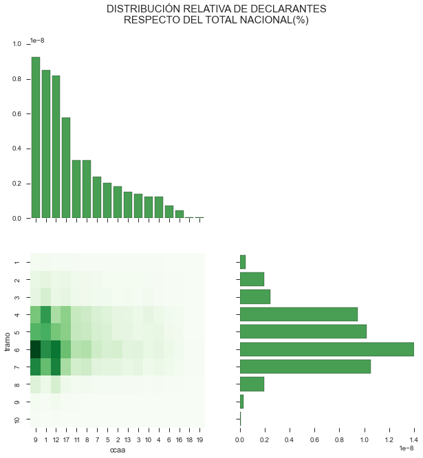
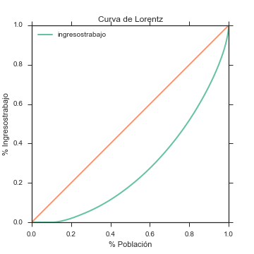
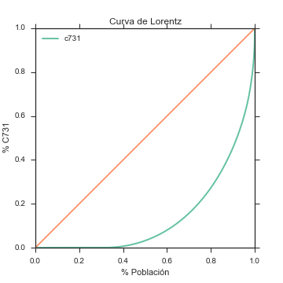
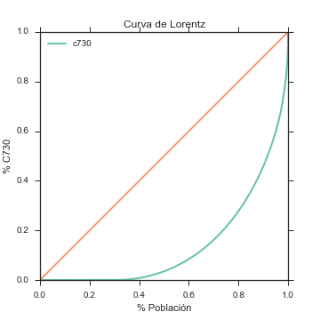
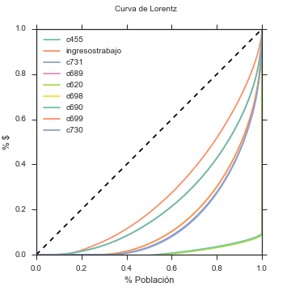
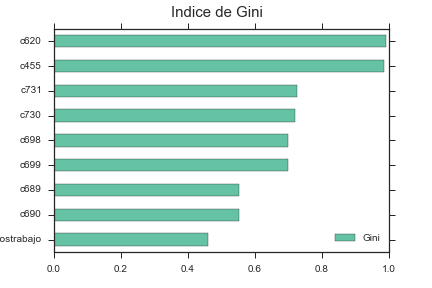

# Trabajo Fin de Grado

## ANÁLISIS REGIONAL DEL IPRF : DESIGUALDAD Y PROGRESIVIDAD REGIONAL PARA ESPAÑA

### Autor

Maximiliano Greco

### Director

Fernando Rodrigo Sauco

--- 

Facultad de Ciencias Económicas y Empresariales
Año 2015

## NOTEBOOK
[TFG](http://nbviewer.ipython.org/github/mmngreco/Fiscal/blob/master/tfg.ipynb)

## PREGUNTAS

1. Contexto del IRPF 2011
1. El perfil del IRPF en España y CCAA
    + Distribucion de población, España y CCAA
    + Distribucion de los ingresos CCAA
    + Distribucion de declarantes por renta
    + Distribucion de declarantes por CCAA y tg
    + Diferencia entre Ingresos CCAA y Estatal
    + Disperción de Cuota Liquida autonómica y Rentas altas
1. ¿Es el IRPF un impuesto progresivo?
    + Progresividad Local
        * LP
        * ARP
    + Progresividad Global
        * Gini
        * RS
        * Atkinson
1. Caso de Aragón. (sería interesante agregar cataluña o madrid y comparar)
    + Perfil
    + Como se sitúa en presión fiscal
    + Indices
        * LP
        * Gini
        * RS
1. Simulación
    + Hipótesis de partida evolución hasta 2016
        * Evolución BI (PIB o Renta Disponible, media BI)

1. Conclusiones
1. Extensiones del Trabajo
    + Competencia Fiscal

---

# DISTRIBUCIÓN DE DECLARANTES POR CCAA

La ditribución de declarantes se concentra sobre todo en la CCAA (9), vemos que los tramos mas densos, son los medios, la distribución parece ser una normal.

# CURVA DE LORENTZ

## CURVA DE LORENTZ

# INDICE DE GINI

|VARIABLES|COEFICIENTE|
|:-------------:|:----------:|
|ingresostrabajo|0.461160|
|c690|0.551929|
|c689|0.552380|
|c699|0.697796|
|c698|0.698056|
|c730|0.720683|
|c731|0.725347|
|c620|0.991811|

# IDEAS:

1. ¿Es el gasto público progresivo?
1. Modelo de distribución de la renta, partiendo del ideal y ver su evolución.
1. ¿Son los individuos racionales?
    - Tributación conjunta vs tributación individual para mismas rentas
1. Contraste de Hipótesis:
     - PARA TODOS LOS SUPUESTOS
     - INTERVALO DE CONFIANZA

# NOTAS

## POSIBLES EXTENSIONES DEL TRABAJO
1. ¿Es el gasto público progresivo?
1. Modelo de distribución de la renta, partiendo del ideal y ver su evolución.
1. ¿Son los individuos racionales?
    - Tributación conjunta vs tributación individual para mismas rentas
1. Contraste de Hipótesis:
     - PARA TODOS LOS SUPUESTOS
     - INTERVALO DE CONFIANZA
1. TERNARY PLOT

# BIBLIOGRAFÍA

- Caro, C. D., Fernández, J. O., & Mayo, J. P. (2013). Progresividad y redistribución por fuentes de renta en el IRPF dual. Hacienda pública española, (206), 57-87. http://dialnet.unirioja.es/servlet/articulo?codigo=4604712
- Álvarez, J. A. (2007). Guía del impuesto sobre la renta de las personas físicas. CISS.
- Dept, I. M. F. F. A. (2013). Fiscal Monitor, October 2013. International Monetary Fund.
- Eichhorn, W. (2012a). Models and Measurement of Welfare and Inequality. (W. Eichhorn, Ed.). Berlin, Heidelberg: Springer Science & Business Media. http://doi.org/10.1007/978-3-642-79037-9
- Eichhorn, W. (2012b). Models and Measurement of Welfare and Inequality. (W. Eichhorn, Ed.). Berlin, Heidelberg: Springer Science & Business Media. http://doi.org/10.1007/978-3-642-79037-9
- Galapero Flores, R. (2015). Las rentas del trabajo en el Impuesto sobre la Renta de las Personas Físicas. Estudio jurídico tributario. Dykinson.
- Garcia, S. A. (2010). Diccionario de Economia Publica. ECOBOOK.
- Jorratt, M. (2011). Evaluando la equidad vertical y horizontal en el impuesto al valor agregado y el impuesto a la renta: el impacto de reformas tributarias potenciales. Los casos del Ecuador, Guatemala y el Paraguay.
- López-Laborda, J. (2009). Tributación de rentas a tipo fijo y progresividad de la imposición sobre la renta. F. Picos y S. Díaz de Sarralde (cords.).
- Nolan, B., Salverda, W., Checchi, D., Marx, I., McKnight, A., & Tóth, I. G. (2014). Changing Inequalities and Societal Impacts in Rich Countries. Oxford University Press.
- OECD. (2015). In It Together: Why Less Inequality Benefits All. OECD Publishing. http://doi.org/10.1787/9789264235120-en
- Pfingsten, A. (2012). The Measurement of Tax Progression (Vol. 20). Berlin, Heidelberg: Springer Science & Business Media. http://doi.org/10.1007/978-3-642-82652-8
- Salverda, W., Nolan, B., & Smeeding, T. M. (2009). The Oxford Handbook of Economic Inequality. OUP Oxford.
- Shi, L., Li, S., Sato, H., & Sicular, T. (2013). Rising Inequality in China. (S. Li, H. Sato, & T. Sicular, Eds.). Cambridge: Cambridge University Press. http://doi.org/10.1017/CBO9781139035057
- Silber, J. (2012a). Handbook of Income Inequality Measurement. (J. Silber, Ed.). Dordrecht: Springer Science & Business Media. http://doi.org/10.1007/978-94-011-4413-1
- Silber, J. (2012b). Handbook of Income Inequality Measurement. (J. Silber, Ed.). Dordrecht: Springer Science & Business Media. http://doi.org/10.1007/978-94-011-4413-1
- Stiglitz, J. E. (2003). La economía del sector público. Antoni Bosch editor.

